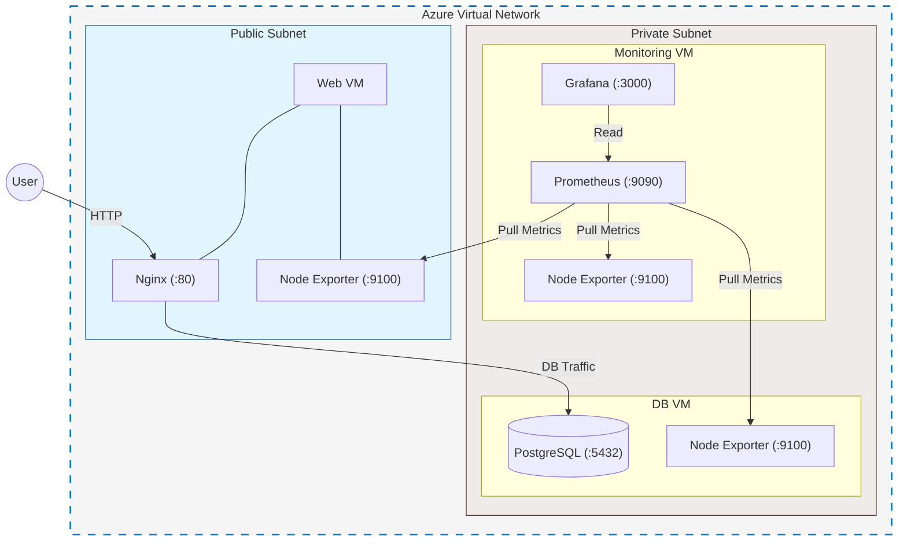

# Multi-Tier Azure Infrastructure with Terraform and Ansible Automation


**Automated the deployment of a secure multi-tier infrastructure in Azure using Terraform and Ansible, featuring Nginx web server, PostgreSQL database, and Prometheus/Grafana monitoring stack.**

## Architecture Overview



| Component | Subnet | Services |
|-----------|--------|----------|
| **Web VM** | Public | Nginx, Node Exporter |
| **DB VM** | Private | PostgreSQL, Node Exporter |
| **Monitoring VM** | Private | Prometheus, Grafana, Node Exporter |

## Tech Stack

| Category | Tools |
|----------|-------|
| **IaC** | Terraform, Azure |
| **Config** | Ansible |
| **Web** | Ubuntu Server 24.04, Nginx |
| **Database** | PostgreSQL |
| **Monitoring** | Prometheus, Grafana, Node Exporter |

## Quick Start

### 1. Deploy Infrastructure

```bash
cd terraform/
terraform init
terraform plan
terraform apply -auto-approve
```

### 2. Configure Services

```bash
ansible-playbook site.yml
```

### 3. Validate

```bash
# Web server
curl http://$web_ip 

# Prometheus targets
curl http://$monitoring_ip:9090/api/v1/targets

# Node Exporter (from monitoring VM)
curl http://$db_ip:9100/metrics
```


## Deployment Checklist

- [x] `terraform apply` completes
- [x] All VMs reachable via SSH
- [x] `curl http://$web_ip` serves HTML
- [x] Prometheus shows 3/3 targets UP
- [x] Grafana login works (admin/admin)
- [x] Node Exporter metrics scrape successfully

## Key Learnings

 **Port Conflicts**: Prometheus apt installation comes with built-in Node Exporter, which conflicts with the manual install → Solution: Install Prometheus binaries to properly configure it

 **NSG Gotcha**: Cross-subnet Prometheus scraping requires explicit NSG rules for port 9100

 **Ansible Tips**:
 - For static HTML, use `files/` directory
 - For a service restart, use handlers
 - For selective runs, use `--tags` for development